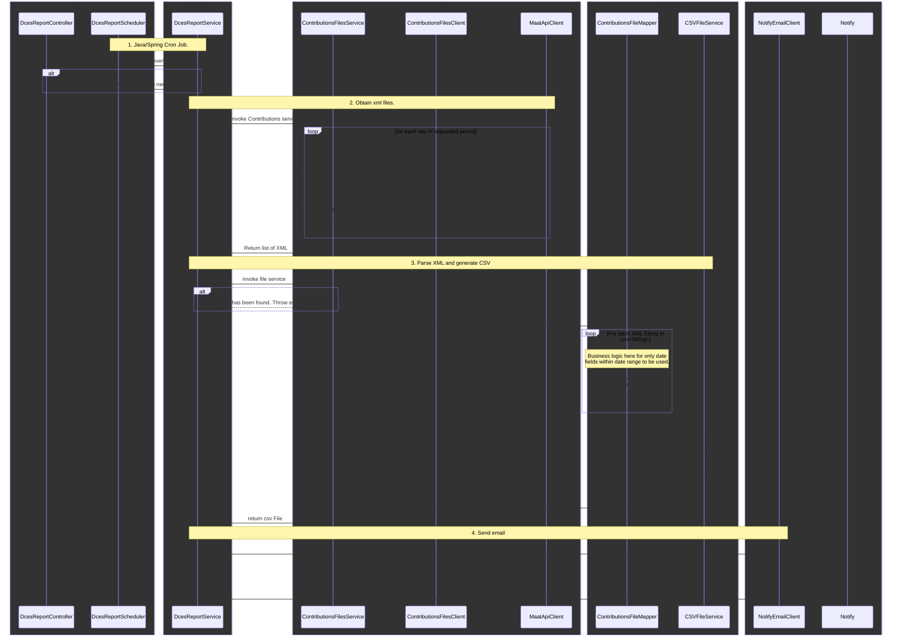

```mermaid
sequenceDiagram

    box rgb(50,50,50) Entry Points
    participant DcesReportController
    participant DcesReportScheduler
    end

    box rgb(50,50,50) Service
    participant DcesReportService
    end


    box rgb(50,50,50) Obtain Files
    participant ContributionsFilesService
    participant ContributionsFilesClient
    participant MaatApiClient
    end

    box rgb(50,50,50) Map XML to CSV
    participant ContributionsFileMapper
    participant CSVFileService
    end
    
    

    box rgb(50,50,50) Email
        participant NotifyEmailClient
        participant Notify
    end

Note over DcesReportScheduler ,DcesReportService: 1. Java/Spring Cron Job.
        DcesReportScheduler->>DcesReportService: Triggers every 30-day  
        alt 
            DcesReportController->>DcesReportService:  adhoc endpoint called directly when needed
        end
        
        Note over DcesReportService ,MaatApiClient: 2. Obtain xml files.
        DcesReportService->>ContributionsFilesService: Invoke Contributions service


        loop for each day in requested period
                ContributionsFilesService->>ContributionsFilesClient: Call process to start MAAT API call
                ContributionsFilesClient->>MaatApiClient: Send request to MAAT API for the day.
                MaatApiClient->>ContributionsFilesClient: Response with XML String
                ContributionsFilesClient->>ContributionsFilesService: Return list of XML
                ContributionsFilesService->>ContributionsFilesService: add to list
        end

        ContributionsFilesService->>DcesReportService: Return list of XML

Note over DcesReportService, CSVFileService : 3. Parse XML and generate CSV


        DcesReportService->>+ContributionsFilesService: invoke file service
        
        alt
            ContributionsFilesService--xDcesReportService :  If no data has been found. Throw error and exit.
        end
        ContributionsFilesService->>ContributionsFileMapper: Pass list of XML, for processing
        
        loop For each XML String in List<String>
            Note over ContributionsFileMapper: Business logic here for only date <br>fields within date range to be used.
            ContributionsFileMapper->>ContributionsFileMapper: Run JaxB to map XML <br> to Logical Objects
        end

        ContributionsFileMapper->>CSVFileService: writeContributionToCsv
        CSVFileService->>CSVFileService: create temporary file
        CSVFileService->>CSVFileService: write logical objects to csv
        CSVFileService->>ContributionsFileMapper: return csv File
        ContributionsFileMapper->>ContributionsFilesService: return csv File
        ContributionsFilesService ->> DcesReportService: return csv File

    Note over DcesReportService, NotifyEmailClient: 4. Send email
    DcesReportService->>NotifyEmailClient: Creating an email config to send out.
    NotifyEmailClient->>Notify: Send Email.
    Notify->>NotifyEmailClient: Email Success
    NotifyEmailClient-xDcesReportService: Return success
    

```
