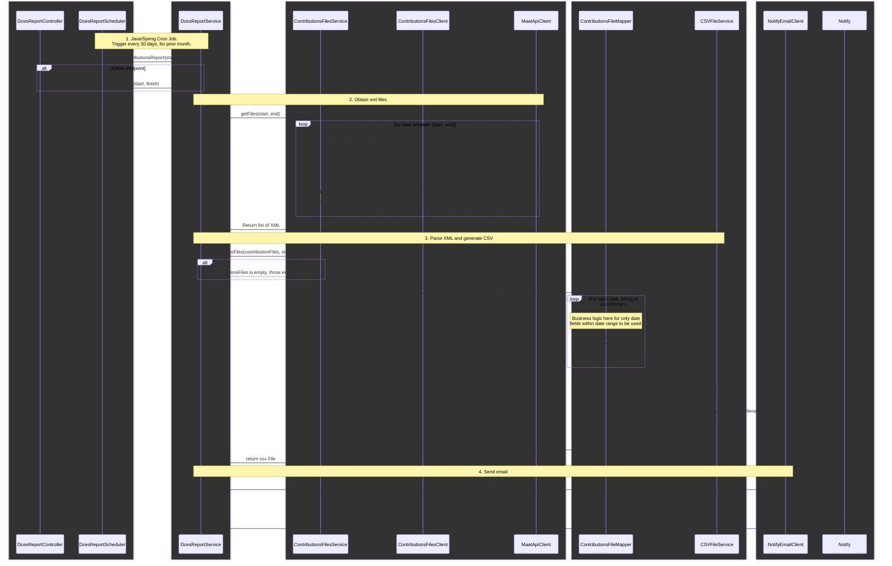

```mermaid
sequenceDiagram

    box rgb(50,50,50) Entry Points
    participant DcesReportController
    participant DcesReportScheduler
    end

    box rgb(50,50,50) Service
    participant DcesReportService
    end


    box rgb(50,50,50) Obtain Files
    participant ContributionsFilesService
    participant ContributionsFilesClient
    participant MaatApiClient
    end

    box rgb(50,50,50) Map XML to CSV
    participant ContributionsFileMapper
    participant CSVFileService
    end


    box rgb(50,50,50) Email
        participant NotifyEmailClient
        participant Notify
    end

Note over DcesReportScheduler ,DcesReportService: 1. Java/Spring Cron Job. <br> Trigger every 30 days, for prior month.
        DcesReportScheduler->>DcesReportService: sendContributionsReport(start, finish)
        alt Adhoc endpoint
            DcesReportController->>DcesReportService:  sendContributionsReport(start, finish)
        end

        Note over DcesReportService ,MaatApiClient: 2. Obtain xml files.
        DcesReportService->>ContributionsFilesService: getFiles(start, end)


    loop for date between (start, end)
        ContributionsFilesService->>ContributionsFilesClient: getContributions(currentDate, currentDate)
        ContributionsFilesClient->>MaatApiClient: /contributions?fromDate={date}&toDate={date}
        MaatApiClient->>ContributionsFilesClient: Response with XML String
        ContributionsFilesClient->>ContributionsFilesService: Return list of XML
        ContributionsFilesService->>ContributionsFilesService: add to list
    end
        ContributionsFilesService->>DcesReportService: Return list of XML

Note over DcesReportService, CSVFileService : 3. Parse XML and generate CSV


        DcesReportService->>+ContributionsFilesService: processFiles(contributionFiles, start, end)

        alt
            ContributionsFilesService--xDcesReportService :  ContributionsFiles is empty, throw error and exit.
        end
        ContributionsFilesService->>ContributionsFileMapper: processRequest(contributionFiles, start, finish, fileName)

        loop For each XML String in List<String>
            Note over ContributionsFileMapper: Business logic here for only date <br>fields within date range to be used.
            ContributionsFileMapper->>ContributionsFileMapper: Run JaxB to map XML <br> to Logical Objects
        end

        ContributionsFileMapper->>CSVFileService: writeContributionToCsv(csvLineList, filename)
        CSVFileService->>CSVFileService: createCsvFile(fileName)
        CSVFileService->>CSVFileService: writeContributionToCsv(csvLineList, filename)
        CSVFileService->>ContributionsFileMapper: return csv File
        ContributionsFileMapper->>ContributionsFilesService: return csv File
        ContributionsFilesService ->> DcesReportService: return csv File

    Note over DcesReportService, NotifyEmailClient: 4. Send email
    DcesReportService->>NotifyEmailClient: Creating an email config to send out.
    NotifyEmailClient->>Notify: Send Email.
    Notify->>NotifyEmailClient: Email Success
    NotifyEmailClient-xDcesReportService: Return success


```
