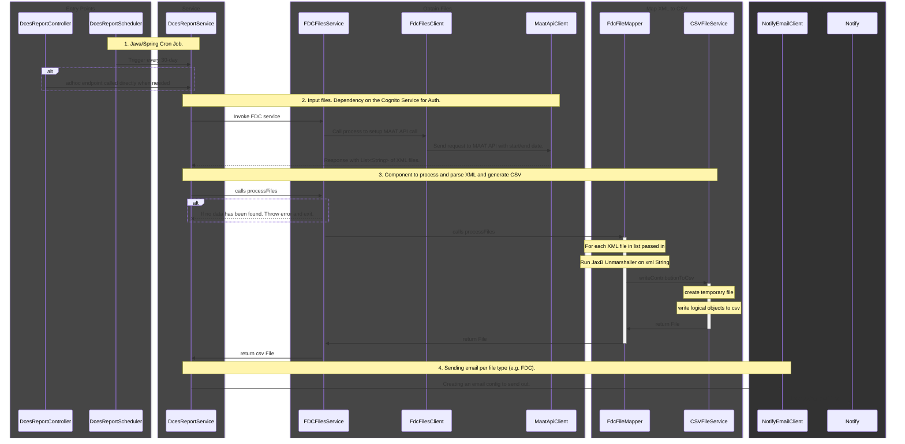

```mermaid
sequenceDiagram

    box rgb(70,70,70) Entry Points
    participant DcesReportController
    participant DcesReportScheduler
    end

    box rgb(70,70,70) Service
    participant DcesReportService
    end


    box rgb(70,70,70) Obtain Files
    participant FDCFilesService
    participant FdcFilesClient
    participant MaatApiClient
    end

    box rgb(70,70,70) Map XML to CSV
    participant FdcFileMapper
    participant CSVFileService
    end
    
    

    box rgb(50,50,50) Email
        participant NotifyEmailClient
        participant Notify
    end

Note over DcesReportScheduler ,DcesReportService: 1. Java/Spring Cron Job.
        DcesReportScheduler->>DcesReportService: Trigger every 30-day  
        alt 
            DcesReportController->>DcesReportService:  adhoc endpoint called directly when needed
        end
        Note over DcesReportService ,MaatApiClient: 2. Input files. Dependency on the Cognito Service for Auth.
        DcesReportService->>FDCFilesService: Invoke FDC service
        
        FDCFilesService->>FdcFilesClient: Call process to setup MAAT API call
        FdcFilesClient->>MaatApiClient: Send request to MAAT API with start/end date.
        MaatApiClient-->>DcesReportService: Response with List<String> of XML files.

Note over DcesReportService, CSVFileService : 3. Component to process and parse XML and generate CSV


        DcesReportService->>+FDCFilesService: calls processFiles
        
        alt
            FDCFilesService--xDcesReportService :  If no data has been found. Throw error and exit.
        end
    FDCFilesService->>+FdcFileMapper: calls processFiles
        
        Note over FdcFileMapper : For each XML file in list passed in
        Note over FdcFileMapper :Run JaxB Unmarshaller on xml String
        FdcFileMapper->>+CSVFileService: writeContributionToCsv
        Note over CSVFileService: create temporary file
        Note over CSVFileService: write logical objects to csv
        CSVFileService->>-FdcFileMapper: return File
        FdcFileMapper->>-FDCFilesService: return File

    
    FDCFilesService ->> DcesReportService: return csv File

    Note over DcesReportService, NotifyEmailClient: 4. Sending email per file type (e.g. FDC).
    DcesReportService->>NotifyEmailClient: Creating an email config to send out.
    NotifyEmailClient->>Notify: Processing the Email.
    

```
