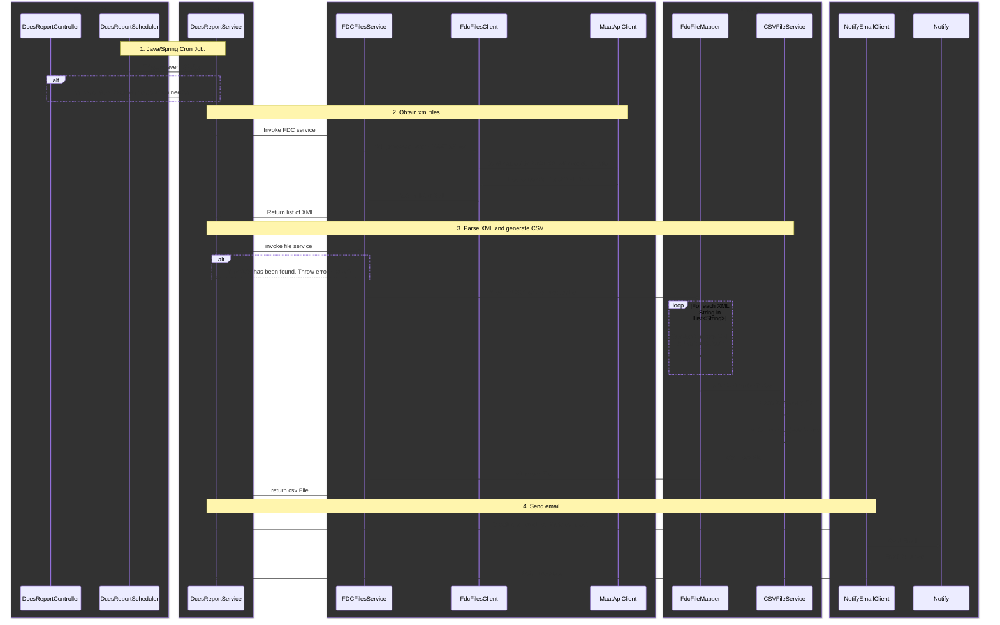

```mermaid
sequenceDiagram

    box rgb(50,50,50) Entry Points
    participant DcesReportController
    participant DcesReportScheduler
    end

    box rgb(50,50,50) Service
    participant DcesReportService
    end


    box rgb(50,50,50) Obtain Files
    participant FDCFilesService
    participant FdcFilesClient
    participant MaatApiClient
    end

    box rgb(50,50,50) Map XML to CSV
    participant FdcFileMapper
    participant CSVFileService
    end
    
    

    box rgb(50,50,50) Email
        participant NotifyEmailClient
        participant Notify
    end

Note over DcesReportScheduler ,DcesReportService: 1. Java/Spring Cron Job.
        DcesReportScheduler->>DcesReportService: Triggers every 30-day  
        alt 
            DcesReportController->>DcesReportService:  adhoc endpoint called directly when needed
        end
        Note over DcesReportService ,MaatApiClient: 2. Obtain xml files.
        DcesReportService->>FDCFilesService: Invoke FDC service
        
        FDCFilesService->>FdcFilesClient: Call process to setup MAAT API call
        FdcFilesClient->>MaatApiClient: Send request to MAAT API with start/end date.
        MaatApiClient->>FdcFilesClient: Response with list of XML files.
        FdcFilesClient->>FDCFilesService: Return list of XML
        FDCFilesService->>DcesReportService: Return list of XML

Note over DcesReportService, CSVFileService : 3. Parse XML and generate CSV


        DcesReportService->>+FDCFilesService: invoke file service
        
        alt
            FDCFilesService--xDcesReportService :  If no data has been found. Throw error and exit.
        end
        FDCFilesService->>FdcFileMapper: Pass List<String>, for processing
        
        loop For each XML String in List<String>
            FdcFileMapper->>FdcFileMapper: Run JaxB to map XML <br> to Logical Objects
        end

        FdcFileMapper->>CSVFileService: writeContributionToCsv
        CSVFileService->>CSVFileService: create temporary file
        CSVFileService->>CSVFileService: write logical objects to csv
        CSVFileService->>FdcFileMapper: return csv File
        FdcFileMapper->>FDCFilesService: return csv File
        FDCFilesService ->> DcesReportService: return csv File

    Note over DcesReportService, NotifyEmailClient: 4. Send email
    DcesReportService->>NotifyEmailClient: Creating an email config to send out.
    NotifyEmailClient->>Notify: Send Email.
    Notify->>NotifyEmailClient: Email Success
    NotifyEmailClient-xDcesReportService: Return success
    

```
