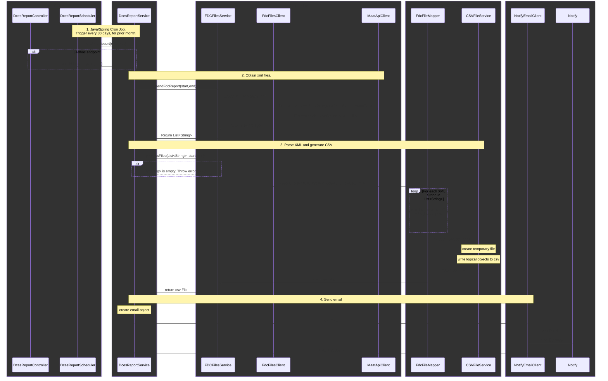

```mermaid
sequenceDiagram

    box rgb(50,50,50) Entry Points
    participant DcesReportController
    participant DcesReportScheduler
    end

    box rgb(50,50,50) Service
    participant DcesReportService
    end


    box rgb(50,50,50) Obtain Files
    participant FDCFilesService
    participant FdcFilesClient
    participant MaatApiClient
    end

    box rgb(50,50,50) Map XML to CSV
    participant FdcFileMapper
    participant CSVFileService
    end


    box rgb(50,50,50) Email
        participant NotifyEmailClient
        participant Notify
    end

Note over DcesReportScheduler ,DcesReportService: 1. Java/Spring Cron Job. <br> Trigger every 30 days, for prior month.
        DcesReportScheduler->>DcesReportService: sendFdcReport(start,end)
        alt Adhoc endpoint
            DcesReportController->>DcesReportService:  sendFdcReport(start,end)
        end
        Note over DcesReportService ,MaatApiClient: 2. Obtain xml files.
        DcesReportService->>FDCFilesService: sendFdcReport(start,end)

        FDCFilesService->>FdcFilesClient: getContributions(start, end)
        FdcFilesClient->>MaatApiClient: final-defence-cost?fromDate={startDate}&toDate={endDate}
        MaatApiClient->>FdcFilesClient: Response with List<String> of XML files.
        FdcFilesClient->>FDCFilesService: Return List<String>
        FDCFilesService->>DcesReportService: Return List<String>

Note over DcesReportService, CSVFileService : 3. Parse XML and generate CSV


        DcesReportService->>+FDCFilesService: processFiles(List<String>, start, end)

        alt
            FDCFilesService--xDcesReportService :  List<String> is empty. Throw error and exit.
        end
        FDCFilesService->>FdcFileMapper: processRequest(List<String>, getFileName(start, finish))

        loop For each XML String in List<String>
            FdcFileMapper->>FdcFileMapper: Run JaxB to map XML <br> to Logical Objects
        end

        FdcFileMapper->>CSVFileService: writeContributionToCsv
        Note over CSVFileService: create temporary file
        Note over CSVFileService: write logical objects to csv
        CSVFileService->>FdcFileMapper: return csv File
        FdcFileMapper->>FDCFilesService: return csv File
        FDCFilesService ->> DcesReportService: return csv File

    Note over DcesReportService, NotifyEmailClient: 4. Send email
    Note over DcesReportService: create email object
    DcesReportService->>NotifyEmailClient: sendEmail
    NotifyEmailClient->>Notify: sendEmail
    Notify->>NotifyEmailClient: Email Success
    NotifyEmailClient-xDcesReportService: Return success


```
