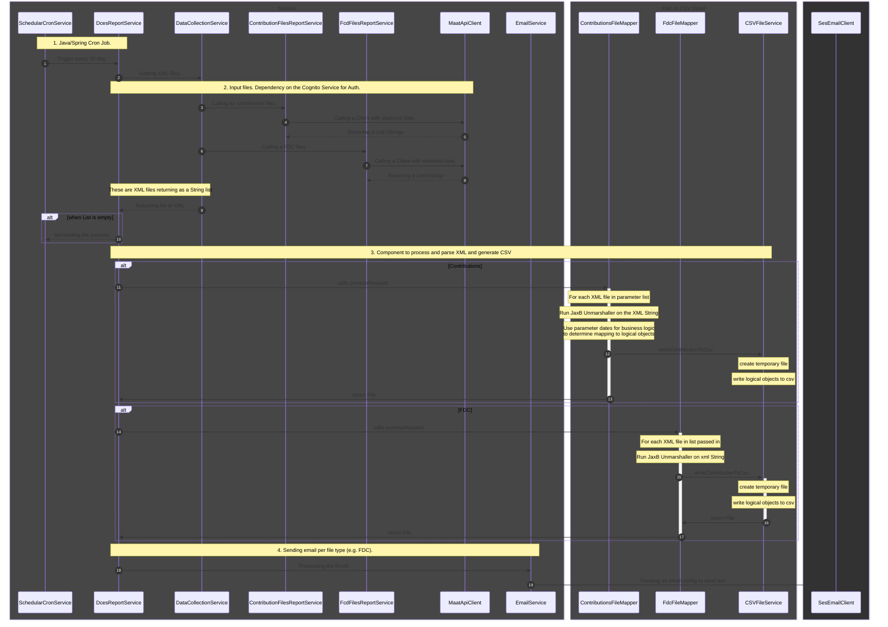

```mermaid

sequenceDiagram
    autonumber
    
    box rgb(70,70,70) Service
    participant SchedularCronService
    participant DcesReportService
    participant DataCollectionService
    participant ContributionFilesReportService
    participant FcdFilesReportService
    participant MaatApiClient
    participant EmailService
    end
    
    box rgb(70,70,70) XML to CSV Detail
    participant ContributionsFileMapper
    participant FdcFileMapper
    participant CSVFileService
    end
    
    box rgb(50,50,50) AWS
        participant SesEmailClient
    end

Note over SchedularCronService ,DcesReportService: 1. Java/Spring Cron Job.
    SchedularCronService->>DcesReportService: Trigger every 30-day
        DcesReportService->>DataCollectionService: Getting XML files.
        Note over DcesReportService ,MaatApiClient: 2. Input files. Dependency on the Cognito Service for Auth.
        DataCollectionService->>ContributionFilesReportService: Calling for contribution files
        ContributionFilesReportService->>MaatApiClient: Calling a Client with start/end date.
        MaatApiClient-->>ContributionFilesReportService: Returning a List<String>

        DataCollectionService->>FcdFilesReportService: Calling a FDC files
        FcdFilesReportService->>MaatApiClient: Calling a Client with start/end date.
        MaatApiClient-->>FcdFilesReportService: Returning a List<String>
        Note over DataCollectionService, DcesReportService : These are XML files returning as a String list
        DataCollectionService-->>DcesReportService: Returning list of XML.
        alt when List is empty
            DcesReportService-->>SchedularCronService: terminating the process.
        end

Note over DcesReportService, CSVFileService : 3. Component to process and parse XML and generate CSV
        
    Alt Contributions
        DcesReportService->>+ContributionsFileMapper: calls processRequest
        Note over ContributionsFileMapper : For each XML file in parameter list
        Note over ContributionsFileMapper :Run JaxB Unmarshaller on the XML String
        Note over ContributionsFileMapper :Use parameter dates for business logic <br> to determine mapping to logical objects
        ContributionsFileMapper->>+CSVFileService: writeContributionToCsv
        Note over CSVFileService: create temporary file
        Note over CSVFileService: write logical objects to csv
        ContributionsFileMapper->>-DcesReportService: return File
    end
    alt FDC
        DcesReportService->>+FdcFileMapper: calls processRequest
        Note over FdcFileMapper : For each XML file in list passed in
        Note over FdcFileMapper :Run JaxB Unmarshaller on xml String
        FdcFileMapper->>+CSVFileService: writeContributionToCsv
        Note over CSVFileService: create temporary file
        Note over CSVFileService: write logical objects to csv
        CSVFileService->>-FdcFileMapper: return File
        FdcFileMapper->>-DcesReportService: return File
    end
    
    Note over DcesReportService, EmailService: 4. Sending email per file type (e.g. FDC).
    DcesReportService->>EmailService: Processing the Email.
    EmailService->>SesEmailClient: Creating an email config to send out.
```
