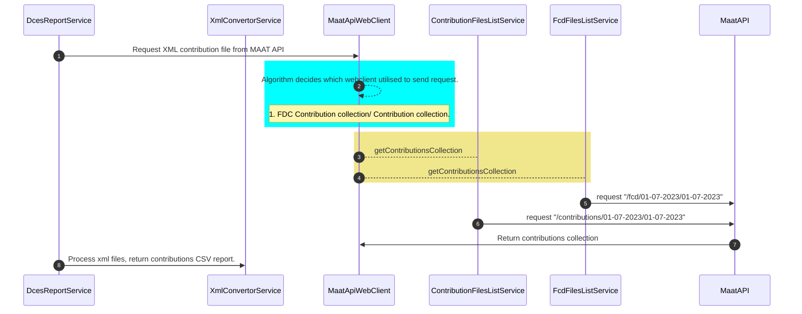

```mermaid

sequenceDiagram
    autonumber
    participant DcesReportService
    participant XmlConvertorService
    participant MaatApiWebClient
    participant ContributionFilesListService
    participant FcdFilesListService
    participant MaatAPI

    DcesReportService->> MaatApiWebClient: Request XML contribution file from MAAT API
    
    rect Cyan
        MaatApiWebClient-->> MaatApiWebClient: Algorithm decides which webclient utilised to send request.
        Note over MaatApiWebClient: 1. FDC Contribution collection/ Contribution collection.
    
    end
    rect khaki
        
        MaatApiWebClient-->ContributionFilesListService: getContributionsCollection
        MaatApiWebClient-->FcdFilesListService: getContributionsCollection
    end
    FcdFilesListService->>MaatAPI: request "/fcd/01-07-2023/01-07-2023"
    ContributionFilesListService->>MaatAPI: request "/contributions/01-07-2023/01-07-2023"
    
    MaatAPI->>MaatApiWebClient: Return contributions collection

    DcesReportService->>XmlConvertorService: Process xml files, return contributions CSV report.

```